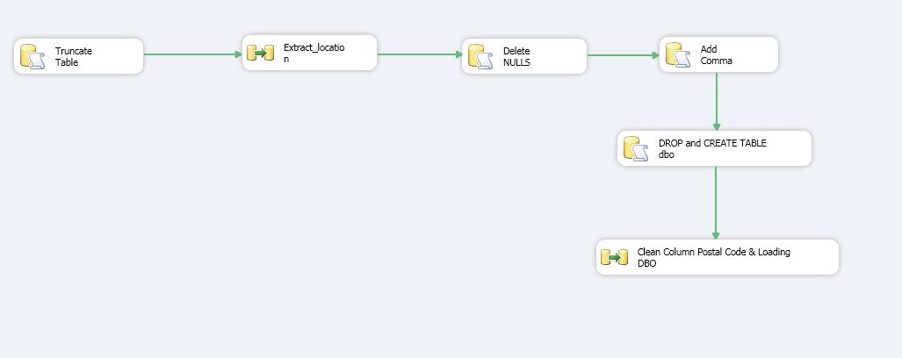

# ETL_SSIS_Project

Available data from STM (Société de transport de Montréal - English: Montreal Transit Corporation) http://www.stm.info/en/about/developers/available-data-description.

# Files:

Agency.txt : Basic information about the STM
Calendar.txt : Information about service availability
Calendar_dates.txt : List of days included in assignment period
Fare_attributes.txt : List of various STM fares
Fare_rules.txt : Explains different fares for regular service and airport shuttle
Feed.txt : Contains information about the feed itself
Frequencies.txt : Defines the frequency of metro service
Routes.txt : List of bus lines
Shapes.txt : Definition of rules for drawing a bus line itinerary on map
Stop_times.txt : Schedule of arrival times at bus stops
Stops.txt : List of bus stops
Trips.txt : Information about trip schedules

# Goal:
Organize the data so it is possible to produce operational reports based on the bus/metro schedule as well as providing analysts with tools to better understand the hidden patterns and anomalies with the bus and metro schedules.

# Steps: 
1) Create a Database Called STM_SRC 
2) Use .stg  and dbo schemas to organize Extraction/Transformation/Loading
3) Use SQL Queries and SSIS Tasks during the ETL process.
4) Implement a DW with 4 Dimension tables and 1 Fact table.

Obs.: The SQL Query used to load the Fact Table used a paremeter because of the machine's memory limitation.

## Sample Details

A screnshot of one of the packages:

## Explaining the Project File and Packages

The Master Package calls all other packages. To run the files individually, you must open and run each one separately. The project has the following packages:

007_MasterPackage.dtsx
Load Agency.dtsx
Load Calendar_dates.dtsx
Load Fare_attributes.dtsx
Load Fare_rules.dtsx
Load Feed_info.dtsx
Load Frequencies.dtsx
Load Locations.dtsx
Load Routes.dtsx
Load Shapes.dtsx
Load Stop_times.dtsx
Load Stops.dtsx
Load Trips.dtsx
S3_load_DimBus.dtsx
S3_Load_DimDate_OK.dtsx
S3_Load_DimFare_OK.dtsx
S3_Load_DimStops_OK.dtsx
S3_Load_FactStopTimes.dtsx

## Final Considerations

If you want to run the package locally, remember to change all the paths, connection managers, and create the Databases and tables locally. This is part of an academic final project.   
